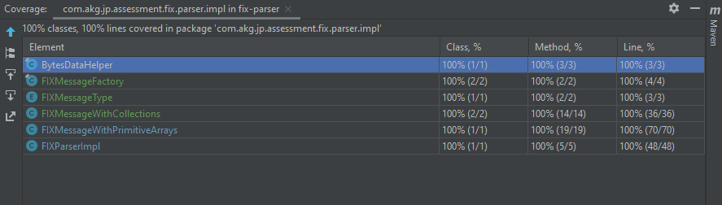
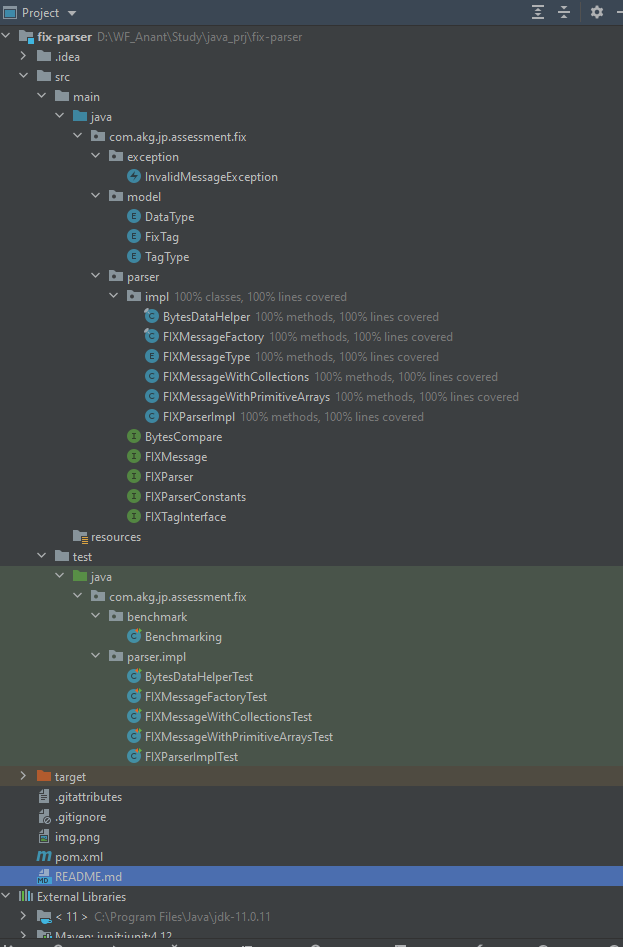

# FIX Message Parser
## Requirement statement

```
Your task is to write a FIX parser.  You can assume that the incoming FIX message will be in a byte array (byte[] msg) and the given byte array will contain one and only one whole FIX message. Provide an API for people to use your parser.

Goal:
1. API must be simple to use
2. Design for efficiency: high performance and small memory footprint. Your goal is make your parser as fast as possible. Do some benchmarks and show the results.

Constraints:
1. You must not use any third-party libraries.  Exception is that Junit is allowed in your unit tests.
```

## Highlights
1. 100% Code Coverage of Concrete Implementation Classes in `com.akg.jp.assessment.fix.parser.impl` package.
2. No external libraries (except JUnit)

## CodeCoverage


## Performance
### Benchmark Process
Benchmark performance done using `com.akg.jp.assessment.fix.benchmark.Benchmarking` in test src. Benchmark comparison is between following 2 types of FIXMessage implementations:
<br> 1. `com.akg.jp.assessment.fix.parser.impl.FIXMessageWithPrimitiveArrays` -- This class uses Java primitive type arrays to referencing the index of repeating tags and values and their lengths. Using this class for testing gives better performance `(4.53 micro sec/msg)`, it also has a higher memory footprint `(0.48G)`
<br> 2. `com.akg.jp.assessment.fix.parser.impl.FIXMessageWithCollections` -- This class uses Java collections from `java.util` for referencing the index of repeating tags and values and their lengths. Using this class for testing is slightly slower in performance `(4.76 micro sec/msg)`, but its memory footprint is better as its take only half the memory used by former `(0.24G)`.

### FixMessage
`
"8=FIX.4.29=19335=D49=SenderCompId56=TargetCompId34=5952=20240908-21:23:01.58811=TESTORDER121=355=0005.HK54=260=20240908-21:23:01.58940=11=TESTCLIENT38=100000078=279=ACC180=50000079=ACC280=50000010=099"
`
### Benchmark Results
```
_____________________________________________________________________________________________________________________________________________________________________
                   FIX Message Class |        Message Count |             Time Taken  |                            Average /msg |        Memory Used | Total Memory
_____________________________________________________________________________________________________________________________________________________________________
       FIXMessageWithPrimitiveArrays |                20000 |                  203 ms |                          10.15 Micro/msg|           20.91 Mb |      0.12 Gb 
       FIXMessageWithPrimitiveArrays |                40000 |                  303 ms |                           7.58 Micro/msg|           87.03 Mb |      0.23 Gb 
       FIXMessageWithPrimitiveArrays |                80000 |                  498 ms |                           6.23 Micro/msg|          -62.10 Mb |      0.39 Gb 
       FIXMessageWithPrimitiveArrays |               160000 |                  993 ms |                           6.21 Micro/msg|           14.42 Mb |      0.48 Gb 
       FIXMessageWithPrimitiveArrays |               320000 |                 1513 ms |                           4.73 Micro/msg|           88.54 Mb |      0.48 Gb 
       FIXMessageWithPrimitiveArrays |               500000 |                 2301 ms |                           4.60 Micro/msg|          -52.04 Mb |      0.48 Gb 
       FIXMessageWithPrimitiveArrays |               800000 |                 3631 ms |                           4.54 Micro/msg|          -82.99 Mb |      0.48 Gb 
       FIXMessageWithPrimitiveArrays |              1000000 |                 4533 ms |                           4.53 Micro/msg|          192.50 Mb |      0.48 Gb 
_____________________________________________________________________________________________________________________________________________________________________
                   FIX Message Class |        Message Count |             Time Taken  |                            Average /msg |        Memory Used | Total Memory
_____________________________________________________________________________________________________________________________________________________________________
           FIXMessageWithCollections |                20000 |                  199 ms |                           9.95 Micro/msg|           32.44 Mb |      0.07 Gb 
           FIXMessageWithCollections |                40000 |                  256 ms |                           6.40 Micro/msg|           11.00 Mb |      0.08 Gb 
           FIXMessageWithCollections |                80000 |                  477 ms |                           5.96 Micro/msg|          -20.99 Mb |      0.24 Gb 
           FIXMessageWithCollections |               160000 |                  755 ms |                           4.72 Micro/msg|           55.00 Mb |      0.24 Gb 
           FIXMessageWithCollections |               320000 |                 1553 ms |                           4.85 Micro/msg|          -37.00 Mb |      0.24 Gb 
           FIXMessageWithCollections |               500000 |                 2381 ms |                           4.76 Micro/msg|          -11.49 Mb |      0.24 Gb 
           FIXMessageWithCollections |               800000 |                 3767 ms |                           4.71 Micro/msg|          -19.00 Mb |      0.24 Gb 
           FIXMessageWithCollections |              1000000 |                 4755 ms |                           4.76 Micro/msg|          122.50 Mb |      0.24 Gb 
```

## Project tree structure



## Usage
To use the parser we need to create an instance of type `com.akg.jp.assessment.fix.parser.FIXParser`, which is an `interface`. The `interface com.akg.jp.assessment.fix.parser.FIXParser` exposes only single method `FIXMessage parse(byte[] msg) throws InvalidMessageException`.
<br>The concrete class `com.akg.jp.assessment.fix.parser.impl.FIXParserImpl` implements this interface for parsing message contained in `byte[]`. To create instance of this class you need to supply value of type `com.akg.jp.assessment.fix.parser.impl.FIXMessageType`.

